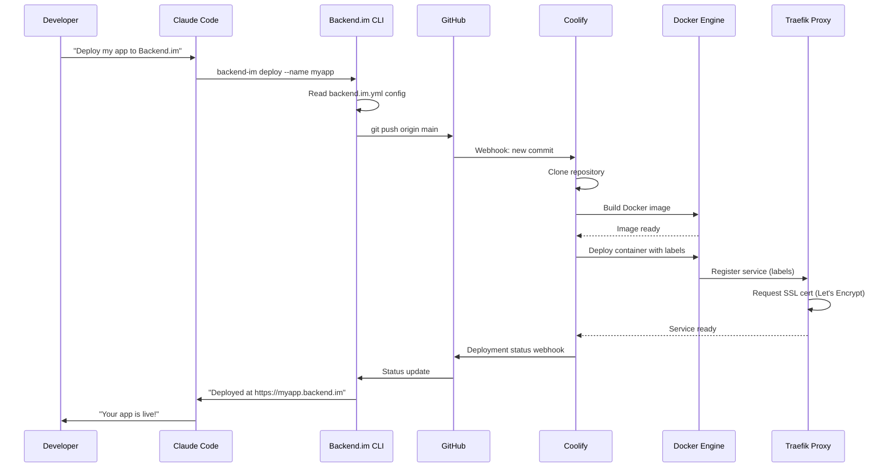

# DevOps Research: Backend.im CLI Deployment Infrastructure

**Author:** Onibonoje Mariam T  
**Date:** October 2025  
**Objective:** Design infrastructure enabling developers to deploy backend code directly via Claude Code CLI
---

## Executive Summary

This document proposes an architecture for enabling developers to deploy backend code directly to Backend.im via Claude Code CLI and AI tools, using primarily open-source technologies with minimal configuration.

---

## 1. Core Problem Analysis

**Goal**: Enable `claude code deploy` or similar one-command deployment from local development to production, orchestrated entirely through AI tools.

**Key Challenges**:
- Zero-config local setup
- Automated provisioning and deployment
- Cost-efficient infrastructure
- AI-friendly interfaces (CLI-first, not GUI)
- Security without complexity

---

## 2. Proposed Architecture

### High-Level Components

```
┌─────────────────────────────────────────────────────┐
│ Developer Workstation                                │
│ ┌─────────────────┐     ┌──────────────────────┐   │
│ │  Claude Code    │────▶│  Backend.im CLI      │   │
│ │  (AI Assistant) │     │  (Deployment Tool)   │   │
│ └─────────────────┘     └──────────┬───────────┘   │
└────────────────────────────────────┼───────────────┘
                                     │
                                     │ Git Push + Webhook
                                     ▼
┌─────────────────────────────────────────────────────┐
│ Version Control (GitHub/GitLab)                      │
│ ┌──────────────────────────────────────────────┐   │
│ │  Repository + Actions/CI                     │   │
│ └───────────────────────┬──────────────────────┘   │
└─────────────────────────┼───────────────────────────┘
                          │
                          │ Trigger Build/Deploy
                          ▼
┌─────────────────────────────────────────────────────┐
│ Backend.im Infrastructure (Cloud VM/VPS)             │
│                                                       │
│ ┌─────────────────────────────────────────────┐    │
│ │  Traefik (Reverse Proxy + Auto SSL)         │    │
│ │  Port 80/443                                 │    │
│ └────────────┬────────────────────────────────┘    │
│              │                                       │
│              ▼                                       │
│ ┌─────────────────────────────────────────────┐    │
│ │  Docker Containers (Apps)                   │    │
│ │  • app-1.backend.im                         │    │
│ │  • app-2.backend.im                         │    │
│ │  • app-3.backend.im                         │    │
│ └─────────────────────────────────────────────┘    │
│                                                       │
│ ┌─────────────────────────────────────────────┐    │
│ │  Portainer (Container Management API)       │    │
│ └─────────────────────────────────────────────┘    │
│                                                       │
│ ┌─────────────────────────────────────────────┐    │
│ │  Coolify (Deployment Orchestrator)          │    │
│ │  • Webhook receiver                         │    │
│ │  • Build automation                         │    │
│ │  • Environment management                   │    │
│ └─────────────────────────────────────────────┘    │
└─────────────────────────────────────────────────────┘
```

---

## 3. Technology Stack (Open Source)

### Core Infrastructure

| Component | Tool | Why | Cost |
|-----------|------|-----|------|
| **Orchestration** | Coolify | Self-hosted Heroku alternative, webhook-driven, Docker-based | Free |
| **Reverse Proxy** | Traefik | Auto SSL, dynamic service discovery, Docker labels | Free |
| **Container Runtime** | Docker | Industry standard, AI-tool friendly | Free |
| **Container Management** | Portainer | REST API for deployments, web UI for monitoring | Free |
| **CI/CD** | GitHub Actions | Free tier generous, webhook integration | Free tier |
| **DNS** | Cloudflare | Free SSL, DNS management, DDoS protection | Free tier |
| **Hosting** | Hetzner/DigitalOcean | $5-20/month VPS | ~$10/mo |

### Developer Tools

| Tool | Purpose | Why |
|------|---------|-----|
| **Backend.im CLI** | Custom deployment CLI | Wraps git + API calls, AI-friendly commands |
| **Claude Code** | AI coding assistant | Orchestrates deployment via CLI |
| **Docker Compose** | Local development | Same config as production |

---

## 4. Deployment Flow

### Step-by-Step Sequence



---

## 5. Local Setup Flow (Developer Experience)

### Initial Setup (One-time)

```bash
# 1. Install Backend.im CLI
curl -fsSL https://backend.im/install.sh | sh

# 2. Authenticate
backend-im login

# 3. Initialize project (creates backend.im.yml)
backend-im init
```

### Configuration File (`backend.im.yml`)

```yaml
# Minimal configuration
name: my-backend-app
runtime: node:20
port: 3000
env:
  NODE_ENV: production

# Optional
healthcheck: /health
domain: my-app.backend.im
scale: 1
memory: 512M
```

### Deployment (AI-Assisted)

**Developer asks Claude Code:**
> "Deploy this app to Backend.im"

**Claude Code executes:**
```bash
# Validate config
backend-im validate

# Deploy
backend-im deploy

# Monitor
backend-im logs --follow
```

**Result:** App live at `https://my-app.backend.im` in ~2 minutes.

---

## 6. Infrastructure Setup (Platform Side)

### Server Requirements
- **VPS**: 2 CPU, 4GB RAM, 80GB SSD (~$10/month)
- **OS**: Ubuntu 22.04 LTS
- **Open Ports**: 80, 443, 22

### Installation Script (`setup-backend-im.sh`)

```bash
#!/bin/bash
# One-command server setup

# 1. Install Docker
curl -fsSL https://get.docker.com | sh

# 2. Install Coolify
curl -fsSL https://get.coolify.io | sh

# 3. Configure Traefik (via Coolify)
# - Enable automatic HTTPS
# - Configure Cloudflare DNS

# 4. Install Portainer (optional)
docker run -d \
  -p 9443:9443 \
  -v /var/run/docker.sock:/var/run/docker.sock \
  -v portainer_data:/data \
  portainer/portainer-ce:latest

# 5. Configure webhook endpoint
# /api/webhooks/deploy

# 6. Set up SSL via Let's Encrypt (automatic)
```

**Time to production-ready**: ~15 minutes

---

## 7. Deployment Sequence Diagram

```
Developer                CLI                  GitHub              Coolify               Docker              Traefik
    |                     |                      |                    |                     |                   |
    |--"deploy app"------>|                      |                    |                     |                   |
    |                     |---git push---------->|                    |                     |                   |
    |                     |                      |---webhook--------->|                     |                   |
    |                     |                      |                    |---clone repo------->|                   |
    |                     |                      |                    |---build image------>|                   |
    |                     |                      |                    |<--image ready-------|                   |
    |                     |                      |                    |---deploy container->|                   |
    |                     |                      |                    |                     |---register------->|
    |                     |                      |                    |                     |<--SSL cert--------|
    |                     |                      |                    |<--service ready-----|                   |
    |                     |<--deploy status------|                    |                     |                   |
    |<--"Live at URL"-----|                      |                    |                     |                   |
```

---

## 8. Where Custom Code Is Required

### Backend.im CLI (`backend-im`)
**Language**: Go (single binary, cross-platform)

**Core Functions**:
```go
// main.go
func main() {
    cmd := &cobra.Command{
        Use: "backend-im",
    }
    
    cmd.AddCommand(
        &cobra.Command{Use: "init"},      // Create config
        &cobra.Command{Use: "deploy"},    // Trigger deployment
        &cobra.Command{Use: "logs"},      // Stream logs
        &cobra.Command{Use: "status"},    // Check app status
        &cobra.Command{Use: "destroy"},   // Remove app
    )
    
    cmd.Execute()
}

func deploy() error {
    // 1. Read backend.im.yml
    // 2. Validate configuration
    // 3. Git push to GitHub
    // 4. Call Coolify webhook API
    // 5. Poll deployment status
    // 6. Return public URL
}
```

**Estimated LOC**: ~500-800 lines

### Coolify Webhook Handler
**Already built-in** - no custom code needed. Configure via UI.

### Traefik Configuration
**Docker Compose labels** - no code needed:
```yaml
services:
  myapp:
    labels:
      - "traefik.enable=true"
      - "traefik.http.routers.myapp.rule=Host(`myapp.backend.im`)"
      - "traefik.http.routers.myapp.tls.certresolver=letsencrypt"
```

---

## 9. Cost Analysis

### Monthly Operating Costs

| Item | Provider | Cost |
|------|----------|------|
| VPS (4GB RAM, 2 CPU) | Hetzner | $6 |
| Domain (backend.im) | Namecheap | $12/year ($1/mo) |
| Cloudflare DNS/SSL | Cloudflare | Free |
| GitHub (private repos) | GitHub | Free tier |
| All software | Open source | $0 |
| **Total** | | **~$7/month** |

### Scaling Costs
- Add apps: $0 (same server)
- More traffic: Upgrade VPS to $12-20/month
- Multiple regions: +$7/region

---

## 10. Security Considerations

### Authentication
- CLI stores API token in `~/.backend-im/config`
- Token-based API authentication (JWT)
- Scoped permissions (deploy, logs, destroy)

### Network Security
- Cloudflare DDoS protection (free tier)
- Fail2ban for SSH
- Docker socket not exposed publicly
- Coolify admin panel on separate subdomain with 2FA

### Secrets Management
- Environment variables via Coolify UI
- Encrypted at rest
- Never in git repository

---

## 11. AI Tool Integration

### Why This Design Works Well with AI

1. **CLI-First**: AI tools excel at CLI commands
2. **Declarative Config**: `backend.im.yml` is parseable
3. **Git-Based**: Familiar workflow for AI
4. **Webhooks**: Automated, no polling needed
5. **RESTful APIs**: Portainer/Coolify have documented APIs

### Example AI Interaction

**User**: "I updated my Node.js app. Deploy the changes."

**Claude Code**:
```bash
# 1. Commit changes
git add .
git commit -m "Update: [auto-generated description]"

# 2. Deploy
backend-im deploy

# 3. Verify
backend-im logs --tail 50
backend-im status
```

**Result**: Deployed in ~90 seconds.

---

## 12. Advantages of This Approach

✅ **Zero lock-in**: All open source, can migrate anytime  
✅ **Cost-effective**: ~$7/month for unlimited apps  
✅ **Fast setup**: 15 min server, 2 min per app  
✅ **AI-friendly**: CLI-first, declarative config  
✅ **Scalable**: Add VPS capacity as needed  
✅ **Secure**: Automatic HTTPS, isolated containers  
✅ **Developer-friendly**: Same Docker setup locally and remotely  

---

## 13. Alternative Approaches (Considered & Rejected)

| Approach | Why Not |
|----------|---------|
| **Kubernetes** | Too complex, expensive, overkill for small projects |
| **AWS/GCP** | High cost, requires credit card, complex IAM |
| **Heroku** | Expensive ($25+/month per app), not open source |
| **Vercel/Netlify** | Backend-only focus, need more control |
| **Self-built from scratch** | Reinventing wheel, maintenance burden |

---

## 14. Proof of Concept Next Steps

### Phase 1: Infrastructure (Week 1)
1. Set up Hetzner VPS
2. Install Coolify + Traefik
3. Configure Cloudflare DNS
4. Test manual deployment

### Phase 2: CLI Development (Week 2-3)
1. Build Go CLI with basic commands
2. Implement webhook triggering
3. Add logging and status checking
4. Package as single binary

### Phase 3: AI Integration Testing (Week 4)
1. Test with Claude Code
2. Refine command structure
3. Improve error messages
4. Document AI-friendly patterns

### Phase 4: Beta Launch (Week 5)
1. Invite early testers
2. Gather feedback
3. Iterate on UX
4. Write comprehensive docs

---

## 15. Conclusion

This architecture enables a **Heroku-like experience** for backend deployments using entirely open-source tools at ~$7/month. The CLI-first design makes it naturally compatible with AI coding assistants like Claude Code, enabling truly one-command deployments.

**Key Innovation**: By combining Coolify (deployment orchestration), Traefik (automatic HTTPS), and a thin CLI wrapper, we achieve professional-grade infrastructure with minimal custom code and maximum developer experience.

The entire system can be set up in under an hour and maintained by a single developer, making it viable for indie hackers, startups, and educational projects.

---

## Appendix: References

- **Coolify**: https://coolify.io
- **Traefik**: https://traefik.io
- **Portainer**: https://www.portainer.io
- **Hetzner**: https://www.hetzner.com
- **Cloudflare**: https://www.cloudflare.com
- **Docker**: https://www.docker.com
- **Let's Encrypt**: https://letsencrypt.org